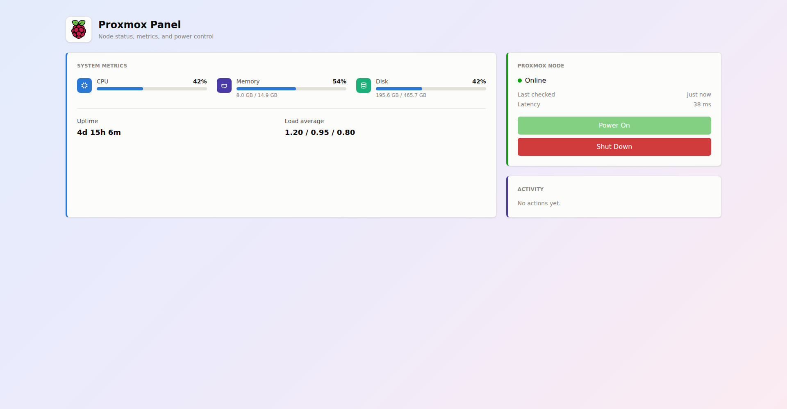

# Proxmox Panel


A small dashboard for monitoring and power-controlling a Proxmox host from a
Raspberry Pi — live metrics, a heartbeat, and buttons that actually do
something: **Power On** sends a Wake-on-LAN magic packet, **Shut Down** calls
Proxmox's own API to gracefully shut the node down (VMs/CTs stop first, same
as clicking Shutdown in the Proxmox UI).



## Stack

- **Backend** — [NestJS](https://nestjs.com/) (TypeScript), talks to the
  Proxmox REST API over HTTPS with an API token, and to the network directly
  for Wake-on-LAN (raw UDP broadcast).
- **Frontend** — [Angular](https://angular.dev/) (standalone components,
  signals), styled with [Tailwind CSS](https://tailwindcss.com/).
- In production the backend serves the built frontend itself
  (`@nestjs/serve-static`), so the whole app is one process on one port.

## Features

- Live CPU / memory / disk / uptime / load average, polled every 5s
- Online/offline heartbeat with a "last checked" indicator and real
  round-trip latency to Proxmox
- **Power On** via Wake-on-LAN, **Shut Down** via the Proxmox API
- Recent-activity log of the last few power actions
- Meters escalate color (blue → amber → red) past 75% / 90% usage

## Project layout

```
backend/    NestJS API — Proxmox integration, WoL, static file serving
frontend/   Angular dashboard
deploy/     systemd service unit template for running this on a Pi
```
